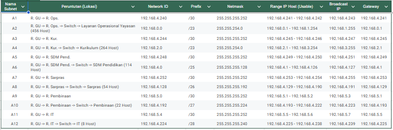
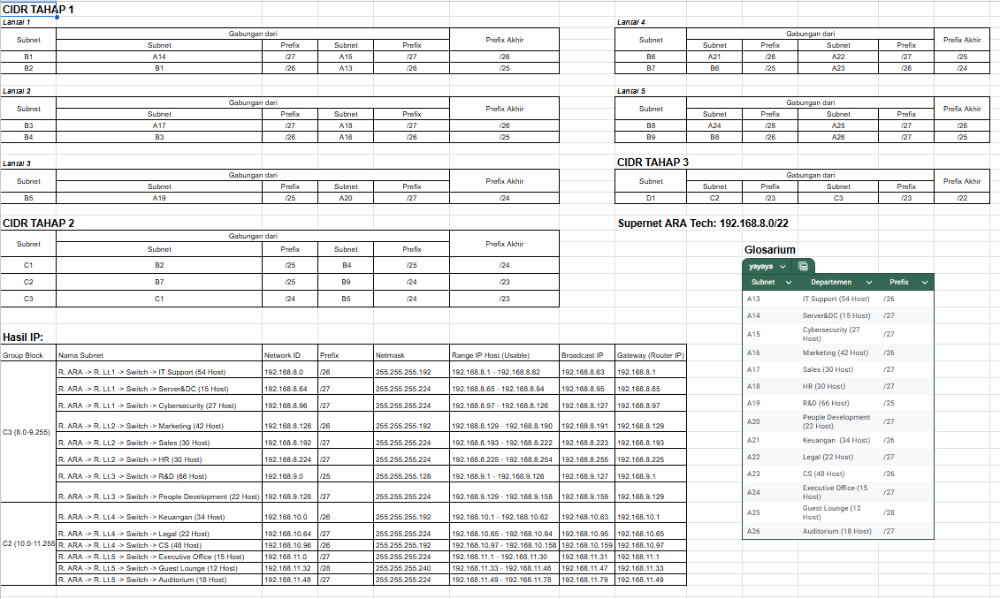

# Final Project Komdat Jarkom Kelompok 6   
## Nama Anggota
- Rayka Dharma Pranandita - 5027241039

## 1. Konsep Topologi (Hierarchical Design)
Kita pakai pendekatan 3 layer standar industri, bukan asal sambung:
*   **Core Layer**: Backbone pusat antar gedung.
*   **Distribution Layer**: Router utama di tiap gedung.
*   **Access Layer**: Router di tiap unit/lantai yang langsung melayani user (Gateway).

Untuk detail spreadsheet pembagian IP sendiri dapat dibuka melalui: https://docs.google.com/spreadsheets/d/10AqrU1hsWAaxuKECFJn-DcIZwCq1CeQe1juj2t_p7ZI/edit?gid=0#gid=0

### A. Gedung Utama (Teknik VLSM)
Perhitungan VLSM:    
Dilakukan dengan mengurutkan host dari yang terbesar ke terkecil, lalu membagi subnet mask sesuai dengan host yang ada (tidak perlu memperhitungkan urutan link):


VLSM Tree:     
     

### B. Gedung ARA Tech (Teknik CIDR & Supernetting)
Perhitungan CIDR: 
Berbeda dengan perhitungan VLSM yang diurutkan dari atas ke bawah, untuk CIDR dilakukan dengan mengurutkan dari bawah ke atas, dengan detail perhitungan:


### C. Kantor Cabang & Interkoneksi
Kantor cabang hanya memiliki satu subnet sehingga tidak diperlukan perhitungan spesifik untuk membagi IPnya

## 2. Konfigurasi Router:
```conf
INTERFACE CONFIGURATION
---------------------------------------------------------------------------
! Link ke Gedung Utama (192.168.5.8/30)
interface Fa0/1
 description Backbone ke Router_Gedung_Utama
 ip address 192.168.5.9 255.255.255.252
 no shutdown
 exit

! Link ke Gedung ARA Tech (192.168.5.12/30)
interface Ethernet0/3/0
 description Backbone ke Router_ARA_Tech
 ip address 192.168.5.13 255.255.255.252
 no shutdown
 exit

! Link ke Kantor Cabang (192.168.5.16/30)
interface Ethernet0/1/0
 description Backbone ke Router_Kantor_Cabang
 ip address 192.168.5.17 255.255.255.252
 no shutdown
 exit

! Link ke ISP (Internet) - Persiapan NAT (Soal 6)
interface Fa0/0
 description Uplink ke ISP Internet
 ip address dhcp
 ! atau static public IP jika ada
 no shutdown
 exit

ROUTING CONFIGURATION (OSPF AREA 0)
---------------------------------------------------------------------------
router ospf 1
 ! Advertise semua network backbone
 network 192.168.5.8 0.0.0.3 area 0
 network 192.168.5.12 0.0.0.3 area 0
 network 192.168.5.16 0.0.0.3 area 0
 ! Default Information Originate (Untuk Internet)
 default-information originate
 exit

===========================================================================
VERIFIKASI
===========================================================================
show ip route
show ip ospf neighbor


```
